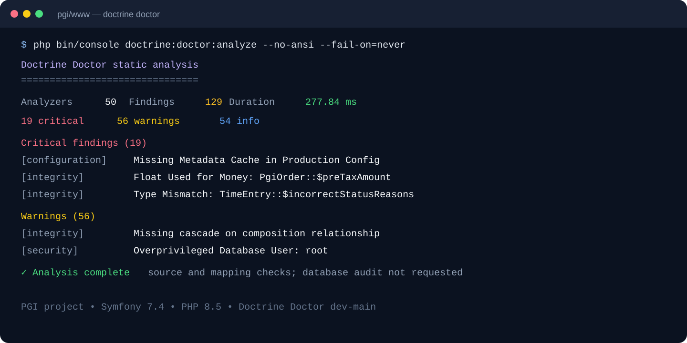
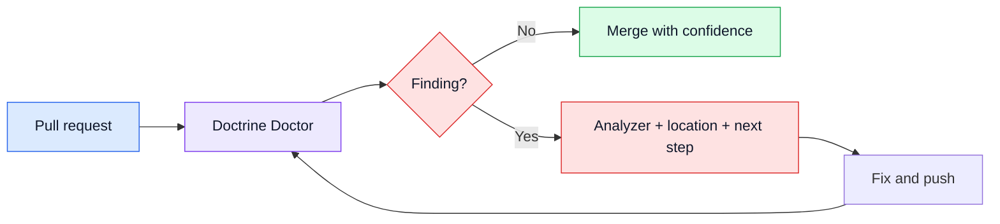

# Doctrine Doctor


**Find Doctrine ORM problems in the profiler. Catch them in CI.**

[](https://php.net)
[](https://symfony.com)
[](https://www.doctrine-project.org)
[](LICENSE)
[](https://github.com/ahmed-bhs/doctrine-doctor/actions)
[](https://phpstan.org)
[](https://www.php-fig.org/psr/psr-12/)
[](https://packagist.org/packages/ahmed-bhs/doctrine-doctor)

<p align="center">
  <a href="#quick-start">Get started</a> ·
  <a href="#add-it-to-ci">Add it to CI</a> ·
  <a href="docs/user-guide/analyzers.md">Browse analyzers</a>
</p>

Doctrine Doctor adds Doctrine-focused feedback to the two places where it is most useful:

| When you need an answer | Doctrine Doctor helps you |
| --- | --- |
| A page is slow | Inspect real queries, timings, and backtraces in the Web Profiler. |
| A change is ready for review | Check source code, mappings, and configuration in CI. |
| A database needs a closer look | Run an opt-in audit with `--with-database`. |

<p align="center">
  
</p>

<p align="center">
  
</p>
<p align="center"><em>Real output from Doctrine Doctor running against PGI.</em></p>

<p align="center">
  
</p>

---

## Choose your feedback loop

<table>
<tr>
<td width="50%" valign="top">

### While you develop

Use the Web Profiler when a real page behaves badly. See the query, timing, pattern, and backtrace together while you still have the page open.

**Best for:** N+1 queries, slow SQL, repeated queries, and expensive hydration.

</td>
<td width="50%" valign="top">

### Before you merge

Run the static checks in CI so every pull request gets the same persistence review, even when no page has been exercised yet.

**Best for:** source code, mappings, configuration, and database-independent design issues.

</td>
</tr>
</table>

## What it catches

Doctrine Doctor ships with more than 100 analyzers grouped by the kind of decision they support:

| Area | Examples |
| --- | --- |
| **Performance** | N+1 queries, missing indexes, slow queries, excessive hydration, unbounded reads, and inefficient joins |
| **Security** | DQL/SQL injection, unsafe QueryBuilder input, sensitive data exposure, and insecure randomness |
| **Integrity** | Cascade and orphan-removal issues, mapping mismatches, type errors, and invalid entity boundaries |
| **Configuration** | Charset, collation, timezone, strict mode, cache, and platform configuration |

See the [full analyzer catalog](docs/user-guide/analyzers.md) for the complete list.

---

## Quick start

**1. Install the bundle**

```bash
composer require --dev ahmed-bhs/doctrine-doctor
```

**2. Open a real page**

The bundle is auto-configured through [Symfony Flex](https://github.com/symfony/recipes-contrib/pull/1882). No YAML is needed for the first run.

**3. Read the feedback**

Refresh the page in the `dev` environment, open the **Symfony Web Profiler**, and select the **Doctrine Doctor** panel.

## Add it to CI

Check your code and mappings on every pull request:

```bash
php bin/console doctrine:doctor:analyze --fail-on=warning
```

The command exits with a failure when it finds a warning or critical issue. Use
`--fail-on=critical` to fail only on critical issues, `--fail-on=info` to fail
on every finding, or `--fail-on=never` to report without failing. Live database
audits are opt-in with `--with-database`.

See the [profiler and CI checks guide](docs/user-guide/execution-modes.md) for
the full analyzer inventory and execution rules.

<details>
<summary><strong>How the feedback flows</strong></summary>



</details>

<details>
<summary><strong>Configuration (optional)</strong></summary>

Configure thresholds in `config/packages/dev/doctrine_doctor.yaml`:

```yaml
doctrine_doctor:
    analyzers:
        n_plus_one:
            threshold: 5  # default, lower to 3 to be stricter
        slow_query:
            threshold: 100  # milliseconds (default)
```

**Enable backtraces** to see WHERE in your code issues originate:

```yaml
# config/packages/dev/doctrine.yaml
doctrine:
    dbal:
        profiling_collect_backtrace: true
```

[Full configuration reference →](docs/user-guide/configuration.md)

</details>

---

<details>
<summary><strong>AI Mate / MCP integration (optional)</strong></summary>

Doctrine Doctor can expose its profiler findings to AI assistants (Claude Code,
Cursor, GitHub Copilot, …) over [MCP](https://modelcontextprotocol.io) through
[Symfony AI Mate](https://symfony.com/doc/current/ai/mate.html). It registers an MCP
tool, `doctrine-doctor-issues`, that reads a profiler request and returns the detected
issues — already sanitized for safe AI consumption.

This is **opt-in**. The bundle ships the integration code but pulls no AI dependency
by default. **Without AI Mate installed, this does not apply and Doctrine Doctor
runs exactly as before.**

[Setup guide & tool reference →](docs/user-guide/ai-mate.md)

</details>

---

## Example: N+1 Query Detection

<table>
<tr>
<td width="50%" align="center"><b>Before — 100 queries</b></td>
<td width="50%" align="center"><b>After — 1 query</b></td>
</tr>
<tr>
<td>

```php
$users = $repository->findAll();
```

```twig

    {{ user.profile.bio }}

```

</td>
<td>

```php
$users = $repository
    ->createQueryBuilder('u')
    ->leftJoin('u.profile', 'p')
    ->addSelect('p')
    ->getQuery()
    ->getResult();
```

</td>
</tr>
<tr>
<td colspan="2">

**Doctrine Doctor detects the N+1 pattern at runtime** — reports query count,
execution time, points to the exact template line, and suggests eager loading with `addSelect()`.

</td>
</tr>
</table>

---

## Documentation

| Document | Description |
|----------|-------------|
| [**Full Analyzers List**](docs/user-guide/analyzers.md) | Browse the built-in checks for performance, security, integrity, and configuration |
| [**Profiler and CI Checks**](docs/user-guide/execution-modes.md) | A quick guide to choosing where to run each check |
| [**Architecture Guide**](docs/advanced/architecture.md) | Deep dive into **system design**, architecture patterns, and technical internals - understand how Doctrine Doctor works under the hood |
| [**Configuration Reference**](docs/user-guide/configuration.md) | Comprehensive guide to **all configuration options** - customize analyzers, thresholds, and outputs to match your workflow |
| [**Template Security**](docs/advanced/template-security.md) | Essential **security best practices** for PHP templates - prevent XSS attacks and ensure safe template rendering |
| [**AI Mate / MCP integration**](docs/user-guide/ai-mate.md) | Optional **AI assistant integration** - expose profiler issues to Claude Code, Cursor, and other MCP clients through Symfony AI Mate |

---

## Contributing

See [Contributing Guide](docs/contributing/overview.md) for guidelines.

## License

MIT License - see [LICENSE](LICENSE) for details.

<div align="right">

---

**Created by [Ahmed EBEN HASSINE](https://github.com/ahmed-bhs)**

<a href="https://github.com/sponsors/ahmed-bhs" target="_blank">
  
</a>

<a href="https://www.buymeacoffee.com/w6ZhBSGX2" target="_blank">
  
</a>

</div>
