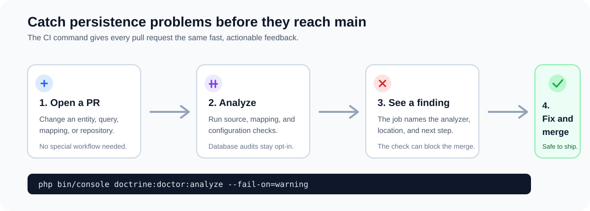
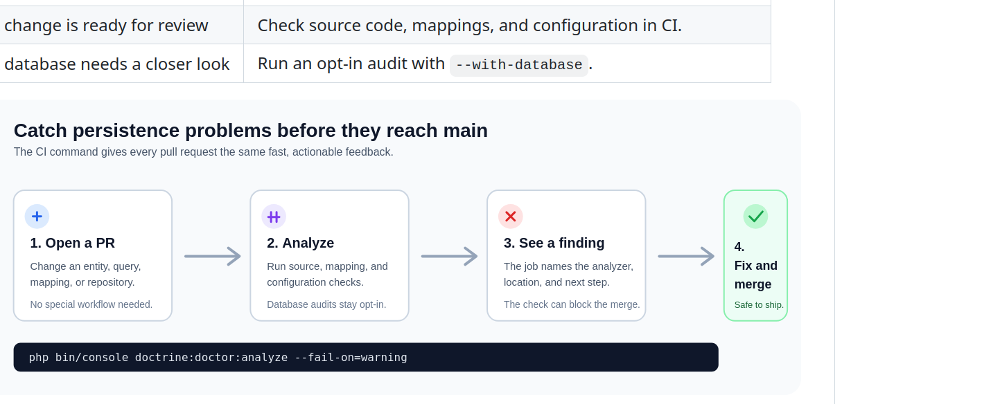

# Doctrine Doctor
{: .fs-9 }

Find Doctrine ORM problems while they are still easy to fix.
{: .fs-6 .fw-300 }

Doctrine Doctor watches real queries in the Symfony Web Profiler and checks
source code, mappings, and optional database configuration in CI. Each finding
includes context and a practical next step.

[Get started now](getting-started/quick-start){: .btn .btn-primary .fs-5 .mb-4 .mb-md-0 .mr-2 }
[View on GitHub](https://github.com/ahmed-bhs/doctrine-doctor){: .btn .fs-5 .mb-4 .mb-md-0 }

---

[](https://php.net)
[](https://symfony.com)
[](https://www.doctrine-project.org)
[](https://github.com/ahmed-bhs/doctrine-doctor/blob/main/LICENSE)
[](https://github.com/ahmed-bhs/doctrine-doctor/actions)
[](https://phpstan.org)

---

## One tool, two useful moments

Doctrine Doctor complements PHPStan and Psalm with checks focused on persistence:

| When you need an answer | Where Doctrine Doctor helps |
|-------------------------|-----------------------------|
| A page is slow or triggers unexpected SQL | The Web Profiler shows request queries, patterns, timings, and backtraces. |
| A change may introduce a persistence problem | CI checks source code, mappings, and configuration before merge. |
| You want to inspect the configured database | Opt in with `--with-database` when a live database is available. |

<p align="center">
  
</p>

---

## What it checks

| Area | Examples |
|------|----------|
| Performance | N+1 queries, slow queries, missing indexes, excessive hydration, unbounded reads, and inefficient joins |
| Security | DQL/SQL injection risks, sensitive data exposure, and insecure randomness |
| Integrity | Cascade and orphan-removal issues, mapping inconsistencies, type mismatches, and invalid entity boundaries |
| Configuration | Charset, collation, timezone, strict mode, cache, and platform configuration |

See [Profiler and CI Checks](user-guide/execution-modes) to choose where each check runs. The [analyzer catalog](user-guide/analyzers) contains the complete list.

<p align="center">
  
</p>

<p align="center">
  
</p>

---

## Quick start

**Step 1: Install**

```bash
composer require --dev ahmed-bhs/doctrine-doctor
```

**Step 2: Load a page in your Symfony app.**

The bundle is auto-configured through [Symfony Flex](https://github.com/symfony/recipes-contrib/pull/1882). No YAML is required for the first run.

**Step 3: Open the profiler panel.**

Open the Web Profiler in the `dev` environment and select the **Doctrine Doctor** panel.

To add deterministic checks to CI:

```bash
php bin/console doctrine:doctor:analyze --fail-on=warning
```

Add `--with-database` only in a job that intentionally provides a live database.

---

## Configuration (Optional)

Configure thresholds in `config/packages/dev/doctrine_doctor.yaml`:

```yaml
doctrine_doctor:
    analyzers:
        n_plus_one:
            threshold: 5  # default, lower to 3 to be stricter
        slow_query:
            threshold: 100  # milliseconds (default)
```

**Enable backtraces** to see WHERE in your code issues originate:

```yaml
# config/packages/dev/doctrine.yaml
doctrine:
    dbal:
        profiling_collect_backtrace: true
```

[Full configuration reference →](user-guide/configuration)

---

## Example: N+1 Query Detection

### Problem: Template triggers lazy loading

```php
// Controller
$users = $repository->findAll();

// Template

    {{ user.profile.bio }}

```

*Triggers 100 queries*

### Detection: Doctrine Doctor detects N+1

- 100 queries instead of 1
- Shows exact query count, execution time
- Suggests eager loading

*Real-time detection*

### Solution: Eager load with JOIN

```php
$users = $repository
    ->createQueryBuilder('u')
    ->leftJoin('u.profile', 'p')
    ->addSelect('p')
    ->getQuery()
    ->getResult();
```

*Single query*

---

## Documentation

| Document | Description |
|----------|-------------|
| [**Configuration Reference**](user-guide/configuration) | Comprehensive guide to all configuration options - customize analyzers, thresholds, and outputs to match your workflow |
| [**Profiler and CI Checks**](user-guide/execution-modes) | Choose where to run Doctrine checks |
| [**Full Analyzers List**](user-guide/analyzers) | Browse the built-in checks for performance, security, code quality, and configuration |
| [**Architecture Guide**](advanced/architecture) | Deep dive into system design, architecture patterns, and technical internals |
| [**Template Security**](advanced/template-security) | Essential security best practices for PHP templates - prevent XSS attacks and ensure safe template rendering |

---

## Contributing

We welcome contributions! See our [Contributing Guide](contributing/overview) for details.

---

## License

MIT License - see [LICENSE](about/license) for details.

---

**Created by [Ahmed EBEN HASSINE](https://github.com/ahmed-bhs)**

[](https://github.com/sponsors/ahmed-bhs)
[](https://www.buymeacoffee.com/w6ZhBSGX2)
